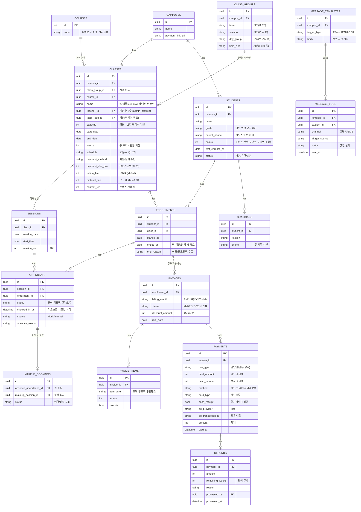
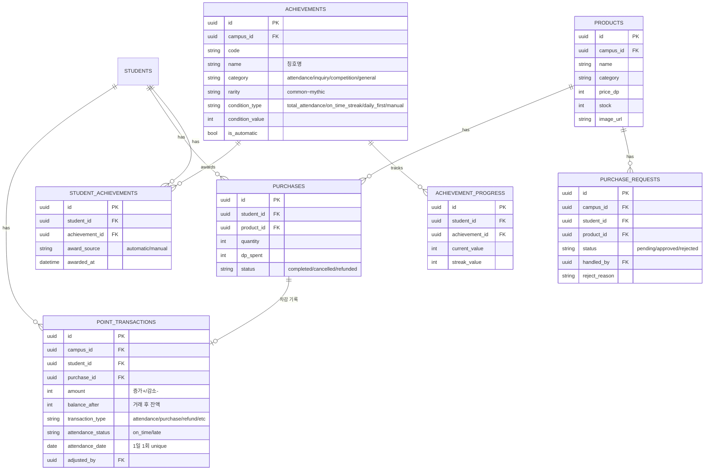

# D.LAB OS — 학원 관리 솔루션 PRD

> 버전: v0.3 (2026-06-12) · 작성: AX전략팀
> 용도: Claude Code 입력용. UI 프로토타입(mock 데이터) → DB 연동 → 외부 연동 순으로 단계 구현.
> v0.2 변경: Point-shop(기존 별도 개발 레포) 통합 전략 반영. 키오스크 2개 화면과 포인트·칭호 도메인을 Point-shop 코드베이스에서 인수·재사용. 미결사항 2건(키오스크 인증, 포인트 정책) 확정.
> v0.3 변경: 시연(데모) 시나리오 3종 확정 및 §9 신설. Phase 1 구현 순서를 시연 시나리오 우선으로 재정렬. 데모 전용 연출 장치 명시.
> v0.4 변경: §0 디자인 시스템 신설(DESIGN.md 토큰화, 키오스크 별도 톤). §9에 시나리오 0(학원 운영 생애주기) 추가하여 전체 내러티브로 재구성. Phase 1 화면을 시연 조작용/조회 레이아웃용 2등급으로 분리.
> v0.5 변경: 현행 레거시 솔루션 화면 5종(원생 자료·조건별 원생조회·반 자료·창구수납·출결) 분석 반영. 원생 화면을 조건별 조회/상세/등록(모달) 3분할로 정리. 반 계층 구조 및 "이전 학기 복제" 기능 추가. 결제 모델 정교화(수강년월·할인·결제수단 세부). 현업 도메인 용어 보존 원칙 명시. (분납은 모델에만 반영, 시연 제외)

---

## 0. 디자인 시스템 (최우선 작업)

시연의 첫인상은 톤앤매너에서 결정된다. 화면을 다 만든 뒤 디자인을 입히면 화면마다 재작업이 발생하므로, **디자인 토큰 세팅이 Phase 1의 첫 작업**이다.

**관리자 웹 — 회사 DESIGN.md 적용**
- D.LAB DESIGN.md의 색·타이포·간격·컴포넌트 규칙을 Tailwind theme(`@theme`)으로 변환하여 프로젝트 초기에 세팅.
- 공통 컴포넌트(버튼·카드·뱃지·인풋·테이블·모달) 먼저 구축 → 모든 관리자 화면이 자동으로 톤을 따르도록.
- 차분하고 정보 밀도 높은 업무용 톤.

**키오스크 — 별도 톤 (DESIGN.md 미적용, 의도적 분리)**
- 대표님 참고 이미지 기준: 다크 배경 + 오렌지 포인트 컬러, 게임 HUD 스타일. 환영 배너, 포인트/레벨 카드, 레벨 진행바, 랭킹, 상점이 한 화면에 집약.
- 학생을 유인하는 활기찬 게이미피케이션 톤 — 관리자 웹의 차분함과 의도적으로 대비.
- Point-shop 인수 코드의 기존 톤을 기반으로 참고 이미지에 맞춰 정리. DESIGN.md 토큰을 강제 적용하지 않는다.
- 키오스크 전용 토큰 세트를 `/kiosk` 라우트 그룹 스코프로 별도 관리.

---

## 1. 배경과 목표

D.LAB은 전국 약 30개 캠퍼스를 운영하는 코딩교육 프랜차이즈다. 현재 사용 중인 레거시 학원 관리 솔루션은 출결·수납·시간표가 화면 단위로 분절되어 있고, 출석 체크는 교사 수동 처리 + 미처리 시 Slack 공지 + 전화 확인이라는 수작업 프로세스에 의존한다. 시간표는 보기 불편해 구글 시트로 별도 관리 중이다.

별도로 개발되던 **Point-shop**(Next.js + Supabase, 포인트 적립·상점·칭호 시스템)을 본 프로젝트에 통합한다. 기존 개발자는 더 이상 참여하지 않으며, 코드베이스를 인수하여 D.LAB OS의 포인트 도메인으로 흡수한다.

**목표**
- 시간표를 운영의 허브 화면으로: 출결 확인·결석 처리·보강 예약·반 이동이 시간표 화면 안에서 끝난다.
- 출석 체크의 자동화: 로비 키오스크에서 학생이 자발적으로 체크인 → 학부모 알림톡 자동 발송 → 시간표에 초록불+시간 실시간 반영 → 출석 포인트 자동 적립.
- 결제 내역의 대시보드 자동 연동: PG사 사이트 별도 접속 없이 수납 현황 확인. (토스페이먼츠 전환 전제)
- 메시지 발송의 일원화: 등원 알림·결석 안내·결제 URL·단체 문자가 하나의 발송 모듈을 공유.
- Point-shop 자산의 재사용: 포인트 원장·상점·구매 승인·칭호/스트릭/랭킹 시스템을 새로 만들지 않고 인수한 코드베이스에서 가져온다.

**비목표 (범위 제외)**
- 부가가치세 처리 (세무사 영역)
- 학부모 전용 앱 (알림톡/SMS 수신까지만)
- 커리큘럼 콘텐츠 관리 (LMS 영역)

**현행 솔루션 친숙함 보존 원칙 (레거시 화면 분석 반영)**

현행 레거시 솔루션 화면 5종(원생 자료·조건별 원생조회·반 자료·창구수납·출결)을 분석했다. 레거시는 "한 화면에 모든 필드를 펼치는" 패턴이라 복잡하고 쓰기 어렵다는 평가를 받지만, 사용자가 그 구조에 익숙해져 있다. 그래서 **구조적 친숙함은 유지하고 정보 밀도만 개선**한다.

- 유지(친숙함): 좌측 세로 메뉴 구조, "검색 → 결과 → 상세" 동선, 현업 도메인 용어(재원생/청구/수강년월/납입기준일/완납/유입경로/반명 인코딩 등).
- 개선(복잡도 해소): 모든 필드 동시 노출 대신 탭/단계로 분할, 비빈출 필드 접기, 지금 할 일 안내, 빈출 작업(반 필터 조회, 청구 생성, 반 복제) 일급화.
- 원칙: 익숙한 도시에 길을 더 잘 닦는다. 건물(기능)·길 이름(용어)은 그대로, 동선만 정리.

---

## 2. 도메인 경계 — SSoT 원칙

두 코드베이스의 통합에서 가장 중요한 규칙. **모든 구현은 이 경계를 따른다.**

| 도메인 | 소유 (SSoT) | 테이블 |
|--------|------------|--------|
| 학생·반·회차·수강이력·출결 | **D.LAB OS** | campuses, students, guardians, courses, classes, sessions, enrollments, attendance |
| 수납·결제·환불 | D.LAB OS | invoices, invoice_items, payments, refunds |
| 메시지 발송 | D.LAB OS | message_templates, message_logs |
| 포인트·상점·칭호 | **Point-shop (인수)** | point_transactions, products, purchases, purchase_requests, achievements, student_achievements, achievement_progress, achievement_events, student_attendance_stats |

- Point-shop이 자체 보유하던 마스터성 테이블(departments, students, timetable, class_sessions, student_classes, attendance_logs)은 **전부 OS 테이블로 대체**한다. 포인트 도메인 테이블의 FK를 OS 테이블로 재배선.
- 두 도메인의 연결점은 단 하나: **출석 이벤트**. OS의 attendance insert가 DB 트리거를 통해 포인트 적립(point_transactions)과 칭호 판정(achievement_events)을 발화시킨다. 그 외에 포인트 도메인이 OS 도메인에 쓰기를 하는 경우는 없다.

### Point-shop → OS 테이블 매핑

| Point-shop (기존) | D.LAB OS (대체) | 마이그레이션 메모 |
|---|---|---|
| departments | campuses | 동일 개념. payment_link_url 등 OS 필드 추가 |
| admin_profiles (master/manager/staff) | 권한 모델로 재사용 | 역할 체계 거의 일치. OS 역할(§6)에 매핑 |
| students (points 잔액 포함) | students | points 잔액 컬럼은 포인트 도메인에 유지 |
| timetable | classes | OS classes에 수강료·정원·기간 필드 추가됨 |
| class_sessions | sessions | 구조 거의 동일 |
| student_classes | enrollments | 이력형으로 전환: 기존 row → started_at=created_at, ended_at=null |
| attendance_logs | attendance | 상태 체계 변경(§3.1). 지각은 별도 상태가 아닌 체크인 시각 파생 |
| point_transactions / products / purchases / purchase_requests | 그대로 유지 | balance_after 패턴, 구매 승인(pending/approved/rejected) 플로우 우수 — 변경 없이 채택 |
| achievements 외 칭호 5종 | 그대로 유지 | 출석→칭호 자동화 트리거를 OS attendance에 재연결 |

### 인수 코드 처리 방침

- `/lobby`, `/dashboard` (학생 화면) → OS 모노레포 `/kiosk` 라우트 그룹으로 이관. 키오스크 "내 정보"·"포인트 상점" 화면으로 그대로 사용.
- `app/admin/page.tsx` (6,235줄 단일 파일) → 당분간 별도 admin으로 유지(포인트 조정·상품·칭호 관리 전용). OS 설정/원생 화면으로 점진 이전. **리팩토링을 선행하지 않는다** — 동작하는 코드를 먼저 통합하고 화면 단위로 옮긴다.
- `202606110004_attendance_achievement_automation.sql`의 출석→포인트→칭호 자동화는 핵심 인수 자산. 수동 포인트 지급 트리거 구조를 OS attendance insert 트리거로 재배선.

---

## 3. 화면 구조 (13개 화면 + 6개 모달)

### 관리자 웹 (10개 화면)

| # | 화면 | 핵심 기능 | 출처 |
|---|------|-----------|------|
| 1 | **시간표 허브** ★ | 일별/주간 토글, 출결 실시간 표시, 결석 처리, 보강 예약, 드래그 반 이동 | 신규 |
| 2 | 대시보드 | 매출 현황(항목별), 결제 완료율, 출결 요약 | 신규 |
| 3 | 반 관리 (반 자료) | 반 계층(분류>시간>반), 반 생성, 이전 학기 복제, 수강료·정원·담당·팀장 설정 | 신규 |
| 4 | 조건별 원생 조회 | 필터(반/요일/학년/등록구분/강사)가 일급, 결과 집합 → 문자 발송·엑셀 | 신규 (빈출 화면) |
| 5 | 원생 상세 | 기본/가족/수강이력/수납 탭, 학년, 복원 학생 과거 이력, 포인트·칭호 요약 | 신규 |
| 6 | 출결 자료 | 출결 기록 조회(읽기 전용), 메시지 발송 이력·실패 재발송 | 신규 |
| 7 | 창구수납 | 원생 중심, 청구자료 생성, 항목별 탭(수강료/교재/기타), 미납 조회, 환불 | 신규 |
| 8 | 수납 내역 | 날짜별·조건별 수납 기록 조회 | 신규 |
| 9 | AI 요약 | 상담 녹음 요약, 수업 녹음 요약 (MVP 시연용) | 신규 |
| 10 | 설정 | 메시지 템플릿, 권한, 학년 일괄 업그레이드, 캠퍼스 설정 | 신규 |
| — | (별도) 포인트 admin | 포인트 수동 조정, 상품·재고, 칭호 관리, 구매 승인 | **Point-shop 인수** |

### 키오스크 (3개 화면, 로비 디바이스, `/kiosk` 라우트 그룹)

| # | 화면 | 핵심 기능 | 출처 |
|---|------|-----------|------|
| 11 | 출석 체크 | 학생 본인 체크인 → 알림톡 발송 + 포인트 적립 | 신규 (lobby 인증 플로우 확장) |
| 12 | 내 정보 | 포인트 잔액, 칭호, 오늘 수업·진도, 랭킹 | **Point-shop dashboard 이관** |
| 13 | 포인트 상점 | 포인트로 상품 교환, 구매 요청·승인 | **Point-shop 이관** |

### 모달 (독립 화면 아님)

반 생성/복제 폼 · **신규 원생 등록(모달 또는 별도 탭)** · 결석 처리(사유+보강+알림톡) · 환불 처리 · 문자 발송(템플릿 선택) · 학년 일괄 업그레이드 · 수강료 세부내역(항목 3분할 입력)

원생 등록은 빈출 작업이 아니므로(신규 입학 시즌 집중) 메인 화면을 차지하지 않는다. 조건별 원생 조회·창구수납의 "신규 원생 등록" 버튼으로 호출.

---

## 4. 핵심 화면 상세

### 4.1 시간표 허브 (최우선 구현)

**뷰 모드 — 일별/주간 토글, 마지막 선택 기억**

- **일별 뷰 (운영용)**: 시간대 행 × 반 카드. 카드 안에 학생 칩(이름 + 상태 점 + 체크인 시각). 교사·데스크의 당일 출결 운영 화면.
- **주간 뷰 (계획용)**: 요일 컬럼 × 시간대 행, 구글 캘린더식 그리드. 블록 = 반 단위, 학생 칩 없음. 블록에 출석 요약 배지만 표시:
  - 지난 요일: 결과 요약 (예: `4/4`, `3/4 ·결석1`)
  - 오늘: 실시간 현황 (키오스크 체크인마다 갱신)
  - 미래: `5명 예정`
  - 잔여석 있는 슬롯은 `보강 슬롯 · 잔여 2석` 블록으로 표시
- 드릴다운: 주간 블록 클릭 → 반 상세(학생 단위 패널), 더블클릭 → 해당일 일별 뷰 전환.

**출결 상태 — 4종으로 단순화** (레거시의 10종 상태를 통합)

| 상태 | 표시 | 발생 |
|------|------|------|
| 출석 | 초록 점 + 체크인 시각 | 키오스크 체크인 (수동 보정 가능) |
| 미도착 | 회색 테두리 점 | 수업 전 기본값 |
| 결석 | 빨간 점 | 수업 시작 N분(기본 15분) 경과 시 미도착 → 결석 후보 자동 전환, 담당자 알림 |
| 보강 | 노란 점 | 보강 예약된 학생이 보강 회차에 출석 |

- 지각은 별도 상태가 아님: 출석 + 체크인 시각 > 수업 시작 시각으로 표현. 포인트 도메인의 정시(on_time)/지각(late) 차등 적립도 이 비교에서 파생.
- 결석 후보 자동 전환 시 담당자에게 처리 배지 표시 (기존 Slack 봇 프로세스를 시스템 내부로 흡수).

**결석 처리 모달** (빨간 칩 클릭)

- 결석 사유: 셀렉트(병결/가족 일정/학교 행사/무단) + 직접 입력
- 보강 일시 자동 제안: 잔여석 있는 동일 과정 반의 향후 회차를 시스템이 추천 (잔여석 수 표시)
- 알림톡 미리보기 + `[보강 확정 + 알림톡 발송]` / `[사유만 저장]` 버튼
- 보강 확정 시: makeup_bookings 생성 + 보강 회차 attendance에 보강 row 생성 + 알림톡 발송

**드래그 앤 드롭 — 뷰별로 의미가 다름**

| 뷰 | 드래그 대상 | 의미 | 필요 권한 |
|----|------------|------|----------|
| 일별 | 학생 칩 → 다른 반 카드 | 반 이동 (enrollment 이력 생성) | 학생 이동 권한 |
| 주간 | 반 블록 → 다른 슬롯 | 반 시간대 변경 | 시간표 편성 권한 |

- 반 이동은 기존 enrollment row를 종료(ended_at) + 새 row 생성 방식. 수강 이력 복원 요구사항과 연결.
- 이동 시 확인 다이얼로그 (적용 시점: 즉시 / 다음 회차부터).

### 4.2 키오스크

**인증 방식 (확정)**: 학부모 연락처 뒷 8자리 입력 → 동일 연락처로 등록된 학생이 여러 명이면 학생 선택. Point-shop의 검증된 플로우(`/lobby` + selectionToken 세션) 재사용.

- **출석 체크**: 인증 직후 오늘 수업이 있으면 체크인 버튼 노출. 체크인 즉시 ① attendance 기록(source=kiosk) ② 학부모 알림톡 발송 ("ooo 원생이 10시 10분에 등원하였습니다") ③ 시간표 허브 실시간 반영 ④ 출석 포인트 자동 적립(트리거).
- **내 정보**: 포인트 잔액, 보유 칭호, 연속 출석 스트릭, 오늘 수업·진도, 캠퍼스 랭킹(명예의 전당). 학생 유인 장치 — Point-shop dashboard 화면 이관.
- **포인트 상점**: 상품 카테고리·재고·이미지, 구매 시 포인트 차감. 고가 상품은 구매 요청 → 관리자 승인(pending/approved/rejected) 플로우.

**출석 포인트 정책 (확정, Point-shop 구현 인수)**
- 정시(on_time)/지각(late) 차등 적립. 정시·지각 판정은 OS의 체크인 시각 vs 수업 시작 시각 비교로 자동화.
- 1학생 1일 1회 적립 (DB unique index로 강제).
- 캠퍼스별 "당일 첫 등원" 보너스 (department_daily_first_attendance).
- 연속 정시 출석 스트릭 추적 → 칭호 자동 부여 (예: 10회 연속 정시 = "성실한 예비 모험가").

### 4.3 반 관리 (반 자료) — 레거시 분석 반영

**반 계층 구조** (레거시 좌측 트리 재현)
- 3단 계층: 분류(기수+시즌+요일, 예 "26.여름/토요일") → 시간(0900, 1000…) → 개별 반.
- 반명 인코딩: `[기수][시즌][요일][시간]/[과정]/[담당]` (예 `26여름토0900/맞춤수업/론`). 이 규칙을 classes.name 생성 규칙으로 참고.

**반 세팅 = 청구 템플릿**
- 반별로 수강료·정원·수강기간·납입기준일·수납방식(매월/일시)·담당(강사)·팀장을 세팅 → 신규 입반 시 청구 자료 자동 생성.
- 수강료에 "세부내역"이 있어 교육비/교구비/콘텐츠비 3분할로 입력(§4.4 invoice_items와 연결).
- 정원은 시간표 허브의 보강 자동 제안(잔여석 = 정원 − 등록) 근거.

**개선 포인트 (현업 페인 해소)**
- 레거시 페인: 새 학기마다 반을 하나씩 수동 생성("반 복사" 버튼이 있는 이유).
- 개선: **"이전 학기 반 복제" / "학기 일괄 생성"** 을 일급 기능으로. 시연 생애주기 "학기 열림 → 반 생성" 단계의 와우 모먼트.

### 4.4 원생 화면 (3분할) — 레거시 분석 반영

레거시도 검색 전용 화면(조건별 원생조회)과 개별 편집 화면(원생 자료)을 분리해 쓰고 있었다. 이를 따른다.

**조건별 원생 조회 (운영 단계 최빈출 화면)**
- 가장 빈번한 작업: 특정 반(예: 토요일 수업) 학생만 필터링 조회.
- 상단 필터를 일급 기능으로: 학부·학년·등록구분(재원/퇴원)·반명·강사·등록기간·최초입학일·유입경로.
- 결과 테이블 컬럼: 성명·원생HP·부모HP(모/부)·학부·학교·학년·반명·등록시작일·등록구분·유입경로. (mock 데이터 명세이기도 함)
- 결과 집합 액션: 전체 선택 → 문자 발송(메시지 모듈 §4.5), 엑셀 내보내기. 인원수/건수 카운트 표시.

**원생 상세 (개별 편집)**
- 검색 결과 행 클릭 시 진입. 탭: 기본 / 가족 / 수강이력 / 수납 (+ 포인트·칭호 요약).
- 수강이력 탭: 복원(재등록) 학생의 과거 수강 내역 조회 가능(enrollments 이력형).
- 수납 탭: 그 원생의 청구·수납 이력을 사람 중심으로 조회(창구수납과 동일 데이터, 다른 관점).
- 학년은 연말 일괄 업그레이드(설정 화면)로 별도 처리.

**신규 원생 등록 (모달/탭)**
- 빈출 아님 → 메인 화면 비점유. 조건별 원생 조회·창구수납의 버튼으로 호출.

### 4.5 수납·결제 — 레거시 분석 반영

**청구 항목 3종**

| 항목 | 과세 | 비고 |
|------|------|------|
| 교육비 | 비과세 | 기본 |
| 교구 대여비 | 과세 | 아두이노 등 |
| 콘텐츠 사용비 | — | 아두이노 수업 등에서 교구비와 동시 발생 가능 |

- 반 관리에서 반별 수강료 세팅 → 신규 입반 시 청구 자료 자동 생성. 창구수납의 "청구자료 생성" 버튼이 이 자동화의 실행 지점.
- 부가세 계산·신고는 시스템 범위 밖 (항목별 구분 기록까지만).

**창구수납 화면 (원생 중심)**
- 원생 검색·선택 → 수납대상 반 + 수납 이력 + 신규 수납 입력이 한 화면.
- 수납 이력 탭: 미납자료 / 수강료 / 교재 / 기타 / 전체 (invoice_items 3분할과 대응).
- 수납 입력 필드: 수강년월(수납일자와 별개), 수납구분(완납 — 분납은 모델만, 시연 제외), 대상금액, 할인금액, 수납방법(카드/현금/계좌이체), 카드종류, 현금영수증 발행 여부.
- 한 건에 카드+현금 혼합 수납 가능(카드수납액·현금수납액 분리).
- 장학/할인은 단순 금액 차감이 아닌 별도 관리 가능성 — 데이터 모델에 discount 필드 + 장학 개념 검토.

**결제 수단**
- 오프라인 카드 95~97%, 소수 현금. 온라인은 PG(토스페이먼츠로 전환 예정).
- PG 결제 내역 대시보드 자동 연동 (웹훅). 계좌이체·현금은 수기 입력.
- 결제 URL 포함 문자 발송 (캠퍼스별 결제 링크 설정).

**미납 관리**
- 창구수납 내 미납자료 탭 + 별도 메뉴 "미납/예정자 조회" + 대시보드 미납 알림 — 같은 데이터의 3개 진입점.
- 미납자 집합 → 결제 문자 발송(메시지 모듈 공유).

**환불**
- 중도 탈퇴 시 잔여 주차 기반 환불액 계산 (예: 11주 중 7주 수강 → 4주분).
- 환불 금액·사유·처리자·일시를 refunds 테이블에 이력으로 기록.
- ※ 수강료 환불(refunds, 원화)과 포인트 상점의 구매 취소(purchases.status=refunded, 포인트)는 별개 개념. 혼동 금지.

### 4.6 메시지 발송 모듈 (공통 백엔드)

화면이 아니라 모든 발송 트리거가 공유하는 단일 모듈.

| 트리거 | 출처 화면 | 방식 |
|--------|----------|------|
| 등원 알림 | 키오스크 | 자동 (이벤트) |
| 결석 확인·보강 안내 | 시간표 허브 모달 | 수동 (담당자 확정) |
| 결제 URL | 창구수납 | 수동 |
| 단체 안내 | 조건별 원생 조회 | 수동 (템플릿 + 이름 자동 치환) |

- 채널: 카카오 알림톡 기본, 실패 시 SMS 폴백. (레거시 화면에도 "알림톡 실패 시 SMS전송" 옵션 존재 — 동일 정책)
- 수신 대상: 본인/부/모 선택 (레거시 동일).
- 템플릿: 캠퍼스별 관리(설정 화면), 변수 치환 `{원생명}` `{등원시간}` `{보강일시}` 등.
- 모든 발송은 message_logs에 기록 (수신자, 채널, 트리거 출처, 상태). 실패 건은 출결 자료 화면에서 필터 → 수동 재발송.

### 4.7 대시보드

- 전체 매출 + 항목별(교육비/교구비/콘텐츠비) 매출.
- 등록 학생 중 결제 완료 비율 시각화 (예: 78명 중 62명, 79%).
- 오늘의 출결 요약, 미납 알림.

### 4.8 AI 기능 (MVP 시연 포함)

- 상담 녹음 → STT → 요약·키워드 분석 → 홍보 문구 초안 생성.
- 수업 녹음 → 학생별 활동 요약 → 수업 종료 시 버튼 하나로 학부모 문자 발송.
- Phase 3 구현. MVP에서는 mock 결과 화면으로 시연.

---

## 5. 데이터 모델

### 5.1 코어 도메인 (D.LAB OS — SSoT)



### 5.2 포인트 도메인 (Point-shop 인수 — FK만 OS 테이블로 재배선)



보조 테이블(텍스트로만 명시): `achievement_events`(칭호 판정 이벤트 로그), `student_attendance_stats`(누적/정시/지각 카운트·스트릭 — 트리거로 갱신), `department_daily_first_attendance`(당일 첫 등원 보너스), `point_reason_presets`(수동 조정 사유 프리셋). 모두 Point-shop 스키마 그대로 인수하되 department_id → campus_id로 변경.

### 5.3 도메인 연결: 출석 → 포인트 트리거

```
OS: attendance INSERT (status=출석, source=kiosk)
  └─ DB trigger
      ├─ point_transactions INSERT (type=attendance, on_time/late 판정 = checked_in_at vs session.start_time)
      ├─ student_attendance_stats 갱신 (누적·스트릭)
      ├─ department_daily_first_attendance 판정 (당일 첫 등원 보너스)
      └─ achievement_events INSERT → 자동 칭호 판정 → student_achievements
```

기존 Point-shop의 `202606110004_attendance_achievement_automation.sql` 로직을 OS attendance 기준으로 재작성. **포인트 도메인이 OS 도메인에 쓰기를 하는 유일한 역방향 경로는 없음** — 연결은 항상 OS → 포인트 단방향.

### 설계 원칙

1. **이력 보존**: enrollment는 update가 아닌 종료+신규 생성. 반 이동·복원 학생의 과거 수강 내역 조회 요구사항 충족.
2. **출석은 enrollment에 연결**: 학생이 반을 옮겨도 과거 출석은 당시 enrollment에 남는다.
3. **보강은 attendance 간 연결**: 원 결석 attendance ↔ 보강 회차 attendance를 makeup_bookings가 매핑.
4. **청구 항목은 invoice_items로 분리**: 항목별 매출 대시보드를 위해 항목 단위로 기록.
5. **반은 청구 템플릿**: classes의 수강료·납입기준일·수강기간이 입반 시 invoices로 복사된다. class_groups로 분류>시간>반 3단 계층 표현(레거시 트리 재현).
6. **수납은 수강년월 단위**: invoices.billing_month로 "어느 달 수강분"을 추적. 수납일자(paid_at)와 분리.
7. **메시지 모듈은 도메인 독립**: 출결·수납 어디에도 종속되지 않는 공통 테이블.
8. **포인트는 원장(ledger) 패턴**: 잔액은 point_transactions의 balance_after로 검증 가능. students.points는 캐시.
9. **도메인 간 단방향**: OS → 포인트 (출석 트리거). 포인트 도메인은 OS 테이블을 읽기만 한다.

---

## 6. 권한

Point-shop의 admin_profiles(master/manager/staff) 체계를 인수하여 확장.

| 역할 | 매핑 | 주요 권한 |
|------|------|----------|
| 본사 관리자 | master | 전 캠퍼스 조회, 캠퍼스·과정 설정, 칭호 정의 |
| 캠퍼스 원장 | manager | 자기 캠퍼스 전체, 시간표 편성, 환불 승인, 구매 요청 승인 |
| 데스크/담당자 | staff | 출결 처리, 학생 이동, 수납, 문자 발송, 포인트 수동 조정 |
| 교사(연구원) | staff (담당 반 스코프) | 담당 반 출결 확인·수동 보정 |

- 학생 이동 권한과 시간표 편성 권한은 분리 (드래그 앤 드롭 동작이 뷰별로 다른 권한을 요구).
- 모든 데이터는 campus_id 스코프 (Supabase RLS). master만 크로스 캠퍼스 조회.

---

## 7. 구현 단계

### Phase 1 — UI 프로토타입 (mock 데이터) ← 지금 단계
- 스택: Next.js (App Router) + Tailwind + TypeScript. mock 데이터는 `/lib/mock-data.ts`에 §5 스키마와 동일한 타입으로 작성.
- **0순위 작업 — 디자인 토큰 (§0)**: 화면 제작 전에 DESIGN.md를 Tailwind theme으로 변환 + 공통 컴포넌트 세팅. 키오스크는 `/kiosk` 스코프 별도 토큰. 이걸 먼저 하지 않으면 화면마다 재작업 발생.
- **시연 조작용 화면 (인터랙션까지 구현)** — 생애주기 순서대로:
  ① 반 관리(학기·반 생성, 수강료 세팅) → ② 원생 등록(신규/기존 입반 → 청구 자동 생성) → ③ 키오스크 출석·내 정보·포인트 상점(시나리오 3) → ④ 시간표 허브 일별 뷰(시나리오 1) → ⑤ 창구수납(청구·미납·결제문자) → ⑥ 매출 대시보드(시나리오 2) → ⑦ 시간표 허브 주간 뷰·결석 모달·드래그.
- **조회 레이아웃용 화면 (레이아웃 + mock 데이터, 깊은 인터랙션 생략)** — 좌측 메뉴 클릭 시 제대로 된 목록이 뜨는 수준이면 충분. 솔루션 전체 틀의 완성도 인상을 위함:
  반 현황 · 원생 목록·상세 · 수납 내역 · 출결 자료.
- **데모 전용 연출 장치 (demo-only, 실운영 미포함)**: §9 참조. 체크인 순차 점등, 결석 자동전환 강제 트리거 버튼. mock 단계에 심되 코드에 `// demo-only` 주석으로 명시하여 Phase 2에서 제거 가능하게.
- **키오스크는 신규 제작하지 않는다**: Point-shop의 `/lobby`·`/dashboard`를 `/kiosk` 라우트 그룹으로 이관하고, 출석 체크 단계만 추가. 톤은 §0 키오스크 토큰(대표님 참고 이미지 기준) 유지.
- 드래그 앤 드롭: dnd-kit 권장.

### Phase 2 — DB 연동 + Point-shop 스키마 통합
- Supabase (PostgreSQL) 단일 프로젝트. Point-shop의 기존 Supabase 프로젝트에서 데이터 마이그레이션.
- 마이그레이션 순서: ① OS 코어 테이블 생성 ② Point-shop 마스터성 테이블 데이터 이관 (departments→campuses, students 병합, student_classes→enrollments) ③ 포인트 도메인 테이블 FK 재배선 ④ attendance 트리거 재작성 (§5.3).
- RLS로 campus_id 스코프 권한.
- 실시간 반영: 키오스크 체크인 → 시간표 허브는 Supabase Realtime 구독.
- 결석 후보 자동 전환: 수업 시작 +15분 스케줄 함수 (pg_cron 또는 edge function).

### Phase 3 — 외부 연동
- 카카오 알림톡 발송 (실패 시 SMS 폴백) — 메시지 모듈 구현.
- 토스페이먼츠 웹훅 → payments 자동 기록.
- AI 요약 (STT + LLM 파이프라인).
- Point-shop 별도 admin의 OS 설정 화면 점진 이전.

---

## 8. 미결 사항 (구현 중 결정)

- [x] ~~키오스크 본인 인증 방식~~ → **학부모 연락처 뒷 8자리 + 동명이인 시 학생 선택** (Point-shop 플로우 인수)
- [x] ~~출석 포인트 적립 정책~~ → **정시/지각 차등 + 1일 1회 + 당일 첫 등원 보너스 + 스트릭 칭호** (Point-shop 구현 인수)
- [ ] 결석 후보 자동 전환 기준 시간 (기본 15분, 캠퍼스별 설정 가능 여부)
- [ ] 주간 뷰 반 블록 드래그 시 1회성 변경 vs 이후 전체 회차 변경 선택 UI
- [ ] 토스 전환 일정과 기존 PG(이지페이·골든페이) 병행 기간 처리
- [ ] Point-shop 기존 운영 데이터(학생·포인트 잔액)의 이관 시점과 정합성 검증 절차
- [ ] 포인트 admin(6,235줄)의 OS 이전 범위와 순서 — 우선 후보: 구매 요청 승인(사용 빈도 높음)
- [ ] 분납(分納) 처리 — 데이터 모델에는 반영(payments.pay_type, invoices 부분납 status), 시연 제외. 구축 단계에서 UI 구체화
- [ ] 장학/할인의 관리 방식 — 단순 금액 차감(invoices.discount_amount) vs 별도 장학 테이블. 레거시에 "장학 정보" 영역 존재
- [ ] 반 내 요일·교시별 과목/강사/강의실 분리 — 시연은 반=고정 시간표로 단순화, 구축 시 정교화 검토

---

## 9. 시연 시나리오 (데모용)

시연의 뼈대는 개별 기능 자랑이 아니라 **학원 운영의 생애주기(lifecycle)** 다. 대표님의 설명 순서가 곧 시연 내러티브다: "학기가 열리고 → 반이 만들어지고 → 학생(신규·기존)이 등록되고 → 매일 운영되고(출석·수납) → 그 결과가 매출 대시보드로 쌓인다." 기존 3개 시나리오(허브·키오스크·대시보드)는 이 생애주기의 '운영'과 '결과' 단계에 해당하며, 그 앞단(준비: 반 생성·학생 등록)을 시나리오 0이 채워 전체를 꿴다.

**전체 메시지**: 주인공은 현장 운영자(데스크·원장)와 학생이다. "우리 학원의 한 학기가 시스템 안에서 막힘없이 흐른다 — 현장이 이만큼 편해진다." (대표님은 청중이지 페르소나가 아니다.)

### 시나리오 0 — 학원 운영 생애주기 (전체를 꿰는 내러티브)

좌측 메뉴를 위에서 아래로 훑으며 한 학기의 흐름을 따라간다. 이것이 시연의 마스터 동선이고, 시나리오 1~3은 이 흐름 중 해당 지점에서 깊게 들어가는 장면이다.

| 단계 | 화면 | 보여줄 것 |
|------|------|----------|
| 준비 | 반 관리 | 학기 시작 → 반 생성, 수강 기간·담당 연구원·수강료 세팅 |
| 준비 | 원생 등록 | 신규/기존 학생 입반 → 청구 자료 자동 생성(매출의 출발점) |
| 운영 | 키오스크 출석 (시나리오 3) | 학생 체크인 → 알림·포인트·칭호 |
| 운영 | 시간표 허브 (시나리오 1) | 체크인이 초록불로 점등, 결석 처리·보강 |
| 운영 | 창구수납 | 청구 → 미납 확인 → 결제 문자 |
| 결과 | 매출 대시보드 (시나리오 2) | 위 모든 활동이 매출·결제율로 집계 |

- **인과 강조**: 반 생성 → 학생 등록 → 청구 자동 생성 → (출석·결제) → 대시보드 집계. "앞에서 한 일이 뒤에 자동으로 쌓인다"가 핵심 메시지.
- **발표 동선**: 위 표 순서대로 좌측 메뉴를 따라 내려간다. 단, 운영 단계 내부에서는 키오스크(3)를 먼저 보여주고 그 체크인이 허브(1)에 켜지는 연결을 시연.

**권장 발표 동선(상세)**: 반 관리 → 원생 등록 → [키오스크 출석(3) → 시간표 허브 초록불(1) 연결 시연] → 창구수납 → 매출 대시보드(2) → 조회 화면들(반 현황·원생 목록 등) 빠르게 훑기.

### 시나리오 1 — 시간표 허브
- **페르소나**: 데스크 담당자 / 교사
- **설득 포인트**: "내 손이 덜 간다" — 수동 출석 체크·전화 추적이 사라진다
- **플로우**: 아침 일별 뷰 오픈(전원 미도착·회색) → 키오스크 체크인마다 초록불+시간 점등(실시간) → 수업 시작 +15분, 미도착자 결석(빨간불) 자동 전환 + 처리 배지 → 빨간 칩 클릭 → 결석 처리 모달(사유 + 자동 제안 보강 슬롯 선택) → 보강 확정 시 알림톡 발송 → (선택) 주간 뷰 토글로 이번 주 보강 현황 확인
- **등장 기능**: 일별/주간 토글, 실시간 출결 표시, 결석 자동 전환, 결석 처리 모달, 보강 자동 제안, 알림톡 발송, 드래그 반 이동
- **와우 모먼트**: 실시간 점등 + 결석 자동 전환
- **데모 전용 장치 (필수)**: ① 체크인 도착을 1~2초 간격으로 흘려보내는 순차 점등 데모 모드 ② "지금 결석 처리" 버튼으로 자동 전환을 즉시 트리거. 시간 의존 연출을 발표 중 보여주기 위함

### 시나리오 2 — 매출 대시보드
- **페르소나**: 캠퍼스 원장 (※ 전사/대표 뷰 아님)
- **설득 포인트**: "내 캠퍼스 매출이 한눈에, 매월 손으로 하던 관리가 사라진다" — 가맹점주의 매출 관리 고통 해소가 이 대시보드의 기획 동기
- **플로우**: 대시보드 오픈 → 이번 달 우리 캠퍼스 총매출(흩어진 카드/현금/PG가 이미 합산 = "PG 사이트 따로 안 들어가도 됨") → 항목별 분해(교육비 외 교구비·콘텐츠비 수익 가시화) → 결제 완료율(우리 학생 78명 중 62명, 79% → "21%가 미납") → 미납자 목록 → 결제 URL 문자 일괄 발송으로 즉시 독촉
- **등장 기능**: 매출 집계(결제수단 통합), 항목별 분해, 결제율 시각화, 미납 조회, 결제 문자(시나리오 1·3과 공유하는 메시지 모듈)
- **와우 모먼트**: "흩어진 게 모여 있고, 안 낸 사람을 바로 찾아 그 자리에서 문자 발송" — 매달 수작업이 클릭 두세 번으로
- **데모 데이터 범위**: 단일 캠퍼스만. 전사 롤업 mock 불필요. 상단에 캠퍼스명 표기로 campus_id 스코프(원장은 자기 캠퍼스만) 자연 노출

### 시나리오 3 — 학생 등원 · 포인트 상점
- **페르소나**: 학생 (키오스크)
- **설득 포인트**: 자동화 + 게이미피케이션의 "마법" — 출석 한 번에 알림·포인트·칭호가 동시에
- **플로우**: 키오스크 앞 → 학부모 연락처 뒷 8자리 입력 → (동명이인 시) 본인 선택 → 오늘 수업 있으면 체크인 버튼 → 누르는 순간 ① 출석 기록 ② 학부모 알림톡 ③ 포인트 적립(정시/지각 자동 판정) ④ 칭호 판정 → 내 정보 화면(포인트·칭호·연속출석 스트릭·오늘 진도) → 포인트 상점에서 구매/구매 요청
- **등장 기능**: 키오스크 인증, 출석 체크, 알림톡, 포인트 차등 적립, 칭호 자동 부여, 포인트/칭호/랭킹 표시, 상점 구매·승인 (대부분 Point-shop 인수 코드에 기구현)
- **와우 모먼트 + 시나리오 1 연결**: 이 체크인이 시나리오 1의 초록불을 켜는 바로 그 사건. 키오스크 화면과 시간표 허브를 나란히 띄우면 "같은 데이터, 다른 시점"이 한눈에. 발표 동선이 3→1인 이유

### 시연 준비 체크리스트
- [ ] DESIGN.md → Tailwind theme 변환 + 공통 컴포넌트 세팅(0순위, §0)
- [ ] 키오스크 별도 톤 토큰 세팅(대표님 참고 이미지 기준: 다크+오렌지 HUD)
- [ ] mock 데이터: 단일 캠퍼스, 학생 약 78명, 반 다수, 미납 학생 일부 포함(결제율 79% 재현)
- [ ] 생애주기 동선용 화면 7종(반 관리~대시보드) + 조회 레이아웃 4종 구현
- [ ] 데모 모드 장치 2종(순차 점등, 결석 강제 트리거) 구현 + `// demo-only` 표기
- [ ] 키오스크와 허브를 동시 표시할 화면 구성(2-스크린 또는 분할) 준비
- [ ] 좌측 메뉴 기반 전체 네비게이션 연결(생애주기 순서대로 이동 가능하게)
- [ ] 알림톡/결제문자는 실제 발송 대신 발송 미리보기 토스트로 대체(데모 안전)
