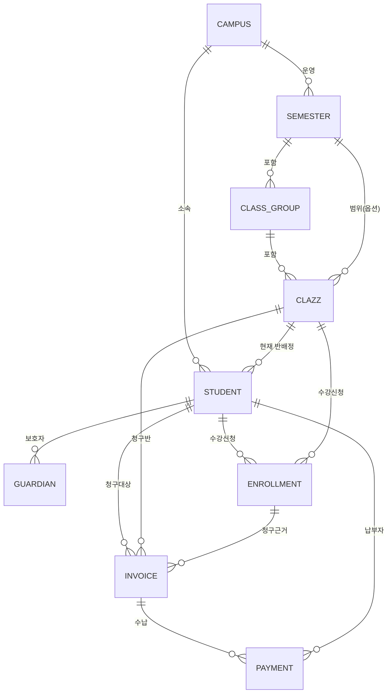

# DB ERD — 반관리 · 원생관리 · 수납내역

현행 프로토타입의 데이터 모델(`lib/mock-data.ts`)을 기준으로 한 ERD입니다.
실제 DB 스키마 설계 시 출발점으로 사용하세요.

## 파일

| 파일 | 용도 |
|------|------|
| `db-erd.svg` | **피그마 임포트용 (권장)** — 벡터, 드래그&드롭 시 편집 가능 |
| `db-erd.png` | 범용 이미지 (3배 해상도 래스터) |
| `db-erd.mmd` | Mermaid 소스 — 수정/재생성·FigJam `/mermaid` 임포트용 |

### 피그마에 넣는 법
- **Figma(디자인)**: `db-erd.svg`를 캔버스로 드래그 → 벡터 도형으로 들어가 색/텍스트 편집 가능. (PNG는 이미지로 박힘)
- **FigJam**: 좌측 도구 → `/mermaid` 또는 Mermaid 위젯에 `db-erd.mmd` 내용을 붙여넣기.
- 재생성: `npx -y @mermaid-js/mermaid-cli -i db-erd.mmd -o db-erd.svg -b white`

> **Figma MCP는 이 작업엔 비권장** — Figma MCP는 "피그마 디자인 → 코드"를 읽어오는 Dev Mode 용도라, *다이어그램을 피그마로 넣는* 이번 목적엔 SVG 임포트가 더 빠르고 깔끔합니다.

## 도메인 구성

- **반관리**: `CAMPUS` → `SEMESTER` → `CLASS_GROUP` → `CLASS` (학기 > 시간그룹 > 반 3단 계층)
- **원생관리**: `STUDENT`, `GUARDIAN`(보호자), `ENROLLMENT`(수강신청 이력)
- **수납내역**: `INVOICE`(청구) → `PAYMENT`(수납)

## 관계 (1 : N)

| 부모 | 자식 | 의미 |
|------|------|------|
| CAMPUS | SEMESTER | 캠퍼스가 학기 운영 |
| CAMPUS | STUDENT | 캠퍼스 소속 원생 |
| SEMESTER | CLASS_GROUP | 학기 내 시간그룹 |
| CLASS_GROUP | CLASS | 시간그룹 내 반 |
| SEMESTER | CLASS | 반의 학기 범위 (옵션 FK) |
| CLASS | STUDENT | 원생의 현재 반배정 (`student.class_id`) |
| STUDENT | GUARDIAN | 원생의 보호자 |
| STUDENT | ENROLLMENT | 원생의 수강신청 |
| CLASS | ENROLLMENT | 반의 수강신청 |
| STUDENT | INVOICE | 청구 대상 원생 |
| CLASS | INVOICE | 청구 반 |
| ENROLLMENT | INVOICE | 청구 근거(수강) |
| INVOICE | PAYMENT | 청구건의 수납 |
| STUDENT | PAYMENT | 납부자 |

## 엔티티 · 필드

표기: 🔑 PK / 🔗 FK / `?` 선택(nullable)

### 반관리

**CAMPUS** — 캠퍼스
| 필드 | 타입 | 비고 |
|------|------|------|
| id | string | 🔑 |
| name | string | 캠퍼스명 |
| payment_link_url | string | 결제 링크 |

**SEMESTER** — 학기
| 필드 | 타입 | 비고 |
|------|------|------|
| id | string | 🔑 |
| campus_id | string | 🔗 CAMPUS |
| year | number | |
| season | string | 봄/여름/… |
| courses | string[] | 개설 과정 |
| status? | enum | 예정/진행 중/종료 |

**CLASS_GROUP** — 반 그룹(학기>시간 계층)
| 필드 | 타입 | 비고 |
|------|------|------|
| id | string | 🔑 |
| campus_id | string | 🔗 CAMPUS |
| semester_id | string | 🔗 SEMESTER |
| year | number | |
| season | string | |
| day_group | string | 요일군 (토 / 화목) |
| time_slot | string | 시간 (0900 …) |

**CLASS** — 반
| 필드 | 타입 | 비고 |
|------|------|------|
| id | string | 🔑 |
| campus_id | string | 🔗 CAMPUS |
| class_group_id | string | 🔗 CLASS_GROUP |
| semester_id? | string | 🔗 SEMESTER (옵션) |
| course | string | 과정명 |
| name | string | 반 풀네임 |
| teacher | string | 강사 |
| team_lead | string | 담임 |
| capacity | number | 정원 |
| start_date / end_date | date | 수강기간 |
| weeks? | number | 주차 |
| schedule | string | 표시 일정 (토 09:00) |
| payment_method | enum | 매월 / 일시 |
| payment_due_day | number | 납입 기준일 |
| tuition_fee | number | 수강료 |
| material_fee | number | 교구비 |
| content_fee | number | 콘텐츠비 |
| enrolled_count | number | 등록 인원 |

### 원생관리

**STUDENT** — 원생
| 필드 | 타입 | 비고 |
|------|------|------|
| id | string | 🔑 |
| campus_id | string | 🔗 CAMPUS |
| class_id | string | 🔗 CLASS (현재 반) |
| name / grade / school | string | |
| parent_phone | string | 모 연락처 (키오스크 인증키) |
| student_phone | string | 원생 HP |
| status | enum | 재원/퇴원/휴원 |
| first_enrolled_at | date | 최초 등록일 |
| source | string | 유입경로 |
| points / streak / title | number/string | 게이미피케이션 |
| gender? | enum | 남/여 |
| division? | string | 학부 |
| father_phone? | string | 부 연락처 |
| other_guardian_phone? / _relation? | string | 그 외 보호자 |
| school_type? | string | 학교구분 |
| special_note? / memo? | string | 특이사항/메모 |
| sibling_ids? | string[] | 재원형제 |
| virtual_account? | string | 가상계좌 |
| scholarship_type? | string | 장학유형 |

**GUARDIAN** — 보호자
| 필드 | 타입 | 비고 |
|------|------|------|
| id | string | 🔑 |
| student_id | string | 🔗 STUDENT |
| relation | enum | 모 / 부 |
| name | string | |
| phone | string | |

**ENROLLMENT** — 수강신청
| 필드 | 타입 | 비고 |
|------|------|------|
| id | string | 🔑 |
| student_id | string | 🔗 STUDENT |
| class_id | string | 🔗 CLASS |
| started_at | date | |
| ended_at | date? | 종료일 (nullable) |
| end_reason | string? | 종료 사유 (nullable) |

### 수납내역

**INVOICE** — 청구
| 필드 | 타입 | 비고 |
|------|------|------|
| id | string | 🔑 |
| student_id | string | 🔗 STUDENT |
| class_id | string | 🔗 CLASS |
| enrollment_id | string | 🔗 ENROLLMENT |
| billing_month | string | YYYY-MM |
| status | enum | 완납/미납/부분납/환불 |
| tuition_amount | number | 수강료 |
| material_amount | number | 교구비 |
| content_amount | number | 콘텐츠비 |
| discount_amount | number | 할인 |
| due_date | date | 납기일 |

**PAYMENT** — 수납
| 필드 | 타입 | 비고 |
|------|------|------|
| id | string | 🔑 |
| invoice_id | string | 🔗 INVOICE |
| student_id | string | 🔗 STUDENT |
| card_amount / cash_amount | number | |
| method | enum | 카드/현금/계좌이체/PG |
| card_type | string | 카드사 |
| card_detail? | string | 일반/체크/기업 |
| cash_receipt | boolean | 현금영수증 발행 |
| cash_receipt_no? | string | 현금영수증 번호 |
| amount | number | 수납액 (환불은 음수) |
| paid_at | datetime | 수납 일시 |
| cancellation_no? | string | 취소번호 |
| special_note? | string | 특이사항 |
| terminal_id? | string | 결제단말기 |
| collector? | string | 수납자 (원장님/리암/키오스크/온라인결제) |

---

> Mermaid 전체 소스(필드 포함)는 [`db-erd.mmd`](db-erd.mmd) 참고. `CLASS`는 Mermaid 예약어라 다이어그램에서는 `CLAZZ`(별칭 "CLASS (반)")로 표기했습니다.
